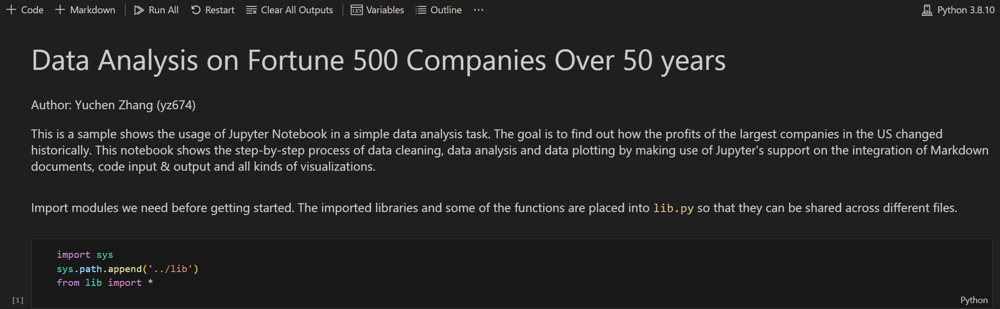
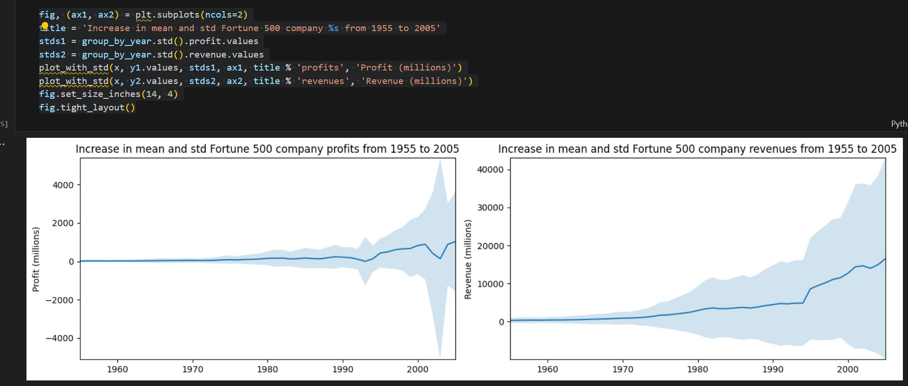

# IDS706_Fall2023_Mini_Project_9_Cloud_Hosted_Notebook

IDS706 week 9 mini project: Set up a cloud-hosted Jupyter Notebook

It contains:

- ``Data_Analysis_on_Fortune_500.ipynb`` the preview and link to the Jupyter Notebook hosted on Google Colab, a Jupyter Notebook that makes use of ``Pandas`` to perform descriptive statistics related to the revenue data of fortune 500 companies over 50 years

- ``.devcontainer`` includes a `Dockerfile` that specifies the configurations of container, and a `devcontainer.json` which is a configuration file used in the context of Visual Studio Code

- ``workflows`` includes `GitHub Actions`, enables automated build, test and deployment for the project

- ``Makefile`` specifies build automation on Linux

- ``requirements.txt`` lists the dependencies, libraries, and specific versions of Python packages required for the project

It also includes ``main.py`` and ``test_main.py`` as sample files to show the functionality of the CI pipeline.

### Jupyter Notebook

Open ``jupyter/fortune500_analyze.ipynb``, the descriptive statistics are shown as an integration of Markdown document and Python code blocks.

You can run each cell separately, or just click ``Run All`` and get all code blocks executed in order. This should generate corresponding plotting for each code block.

### Python Script

First run ``cd ./script/`` to get into the folder, then run ``python3 fortune500_analyze.py``. There should be a `fig.png` plot saved to the same folder, and the output should be the length of dataframe after data cleaning:

